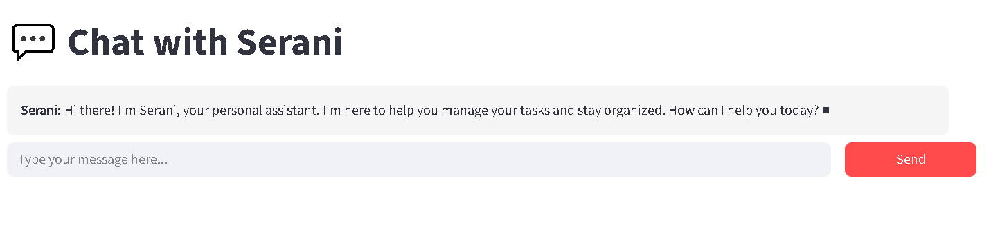

# Contextual Personal Assistant - Serani

A sophisticated multi-agent chatbot system built with OpenAI, ChromaDB, LangChain, and Streamlit for task management and contextual conversations.



## Features

- **🤖 Conversational AI**: Natural language interaction with context awareness
- **📝 Task Management**: Create, update, and manage tasks with conflict resolution
- **🧠 Long-term Memory**: ChromaDB-powered context retention across sessions
- **🎯 Multi-Agent Architecture**: Specialized agents for different functionalities
- **💬 Streamlit Interface**: Modern web-based chat UI
- **⚡ Real-time Processing**: Instant responses with background processing

## Architecture

```
contextual-assistant/
├── agents/                 # Multi-agent system
│   ├── __init__.py        # Agent module exports
│   ├── main_agent.py      # Central conversational router
│   ├── task_agent.py      # Task creation and management
│   └── context_agent.py   # Memory and context handling (ChromaDB)
├── database/              # Data persistence
│   ├── __init__.py        # Database module exports
│   ├── db_manager.py      # SQLite database management
│   └── chroma_db/         # ChromaDB vector storage
├── ui/                    # User interface
│   ├── __init__.py        # UI module exports
│   └── chat_interface.py  # Streamlit chat application
└── utils/                 # Utilities
    ├── __init__.py        # Utils module exports
    └── text_utils.py      # Text processing helpers
```

## System Workflow

### 1. User Interaction Flow
```
User Input (Streamlit UI)
    ↓
MainAgent.process_message()
    ↓
[Intent Analysis] → Determine user intent
    ↓
Route to appropriate handler:
    ├─→ Task Creation Handler
    ├─→ Task Query Handler
    ├─→ Task Update Handler
    ├─→ Clarification Handler
    └─→ General Conversation Handler
```

### 2. Task Creation Workflow
```
User: "I have a dentist appointment tomorrow at 2 PM"
    ↓
[MainAgent] Analyze Intent → "task_creation"
    ↓
[TaskAgent] Parse Task Intent
    ├─ Extract: title="Dentist Appointment"
    ├─ Extract: due_date="2025-11-13"
    ├─ Extract: due_time="14:00"
    └─ Check for conflicts
    ↓
[Database] Check existing tasks for conflicts
    ↓
If conflict → Ask user for resolution
If no conflict → Create task in SQLite
    ↓
[ContextAgent] Store conversation summary in ChromaDB
    ↓
Return confirmation to user: "Got it! I've added your dentist appointment..."
```

### 3. Context Retrieval Workflow (RAG Pattern)
```
User sends new message
    ↓
[ContextAgent] Build context prompt
    ├─ Generate embedding for user query
    ├─ Query ChromaDB for similar past conversations
    ├─ Retrieve top 5 relevant context chunks
    └─ Add recent 3 messages for immediate context
    ↓
[MainAgent] Use retrieved context in system prompt
    ↓
[OpenAI LLM] Generate contextually-aware response
    ↓
Return response to user
```

### 4. Memory Management Workflow
```
Every 4 messages (2 user + 2 assistant exchanges):
    ↓
[ChatInterface] Trigger summarization
    ↓
[OpenAI LLM] Generate concise summary
    ├─ Focus on: key tasks, user preferences, decisions
    ├─ Output: 1-2 sentence summary
    └─ Example: "User scheduled dentist appointment for Nov 13 at 2 PM with 30-min reminder"
    ↓
[ContextAgent] Store in ChromaDB
    ├─ Generate embedding using OpenAI embeddings
    ├─ Store with metadata: {user_id: "1"}
    └─ Persist in vector database
    ↓
Future conversations can retrieve this context
```

### 5. Task Update Workflow
```
User: "Remind me 30 minutes before the appointment"
    ↓
[MainAgent] Detect intent → "task_update"
    ↓
[TaskAgent] Parse update intent
    ├─ Identify task: Most recent or by name
    ├─ Parse change: reminder_offset=30 minutes
    └─ Calculate reminder time from due time
    ↓
[Database] Update task with new reminder
    ↓
Return confirmation: "Done! I've updated the reminder..."
```

### 6. Conflict Resolution Workflow
```
User tries to schedule overlapping task
    ↓
[Database] Detect scheduling conflict
    ↓
[MainAgent] Return conflict details to user
    ↓
User provides resolution (reschedule/cancel)
    ↓
[TaskAgent] Execute resolution
    ├─ Reschedule: Update existing task time
    ├─ Cancel: Delete conflicting task
    └─ Force: Create both tasks
    ↓
Complete original task creation
```

## Configuration

### Environment Variables

- `OPENAI_API_KEY`: Your OpenAI API key
- `DATABASE_PATH`: SQLite database path (default: `database/assistant.db`)
- `CHROMA_DB_PATH`: ChromaDB storage path (default: `database/chroma_db`)
- `DEBUG`: Enable debug mode (default: `False`)

### OpenAI API Configuration

The system uses OpenAI's GPT-3.5-turbo model by default. You can modify the model and parameters in `config/settings.py`.

**Estimated API Costs**:
- Conversation processing: ~$0.002-0.01 per message
- Task parsing and intent recognition: ~$0.001-0.003 per operation
- Context summarization: ~$0.005-0.02 per summary

## Quick Start

1. **Install Dependencies**
   ```bash
   pip install -r requirements.txt
   ```

2. **Set Up Environment**
   Create a `.env` file in the project root:
   ```
   OPENAI_API_KEY=your_openai_api_key_here
   ```

3. **Run the Application**
   ```bash
   streamlit run ui/chat_interface.py
   ```

4. **Initialize Assistant**
   - Enter your name in the sidebar
   - Click "Initialize Assistant"
   - Start chatting!


## Database Schema

### Users Table
- `id`: Primary key
- `username`: Unique username
- `created_at`: Account creation timestamp
- `preferences`: JSON preferences storage

### Tasks Table
- `id`: Primary key
- `user_id`: Foreign key to users
- `title`: Task title
- `description`: Task description
- `created_at`: Creation timestamp
- `due_date`: Scheduled due date (YYYY-MM-DD)
- `due_time`: Scheduled due time (HH:MM)
- `reminder_date`: Reminder date (YYYY-MM-DD)
- `reminder_time`: Reminder time (HH:MM)
- `status`: Task status (pending/completed/cancelled) - Default: pending


## Features in Detail

### Natural Language Processing
- **Intent Recognition**: Automatically classifies user intent (task creation, query, update, chat)
- **Time Parsing**: Converts natural language to datetime ("tomorrow evening" → 2025-11-13 18:00)
- **Duration Parsing**: Understands time durations ("two hours" → 120 minutes)
- **Conflict Detection**: Identifies scheduling overlaps and suggests resolutions

### Memory Management
- **Short-term Memory**: Last 3 conversation messages for immediate context
- **Long-term Memory**: ChromaDB embeddings of conversation summaries
- **Contextual Retrieval**: RAG-based similarity search for relevant past conversations
- **Auto-summarization**: Every 4 messages stored as searchable embeddings

### Task Management
- **Natural Language Creation**: "I have a dentist appointment tomorrow at 2 PM"
- **Automatic Conflict Detection**: Alerts when tasks overlap
- **Smart Updates**: "Remind me 30 minutes before" updates the most recent task
- **Status Tracking**: Pending, completed, cancelled states
- **Flexible Reminders**: Absolute time or relative ("30 minutes before")


## Development Commands

```bash
# Activate virtual environment
.\venv\Scripts\Activate.ps1

# Run application
streamlit run ui/chat_interface.py

# View database
python view_db.py


```

## Technologies Used

- **OpenAI GPT-3.5-turbo**: Natural language understanding and generation
- **ChromaDB**: Vector database for embeddings and semantic search
- **LangChain**: LLM orchestration and prompt management
- **Streamlit**: Modern web UI framework
- **SQLite**: Relational database for structured data
- **Tiktoken**: Token counting and management
- **DateParser**: Natural language date/time parsing